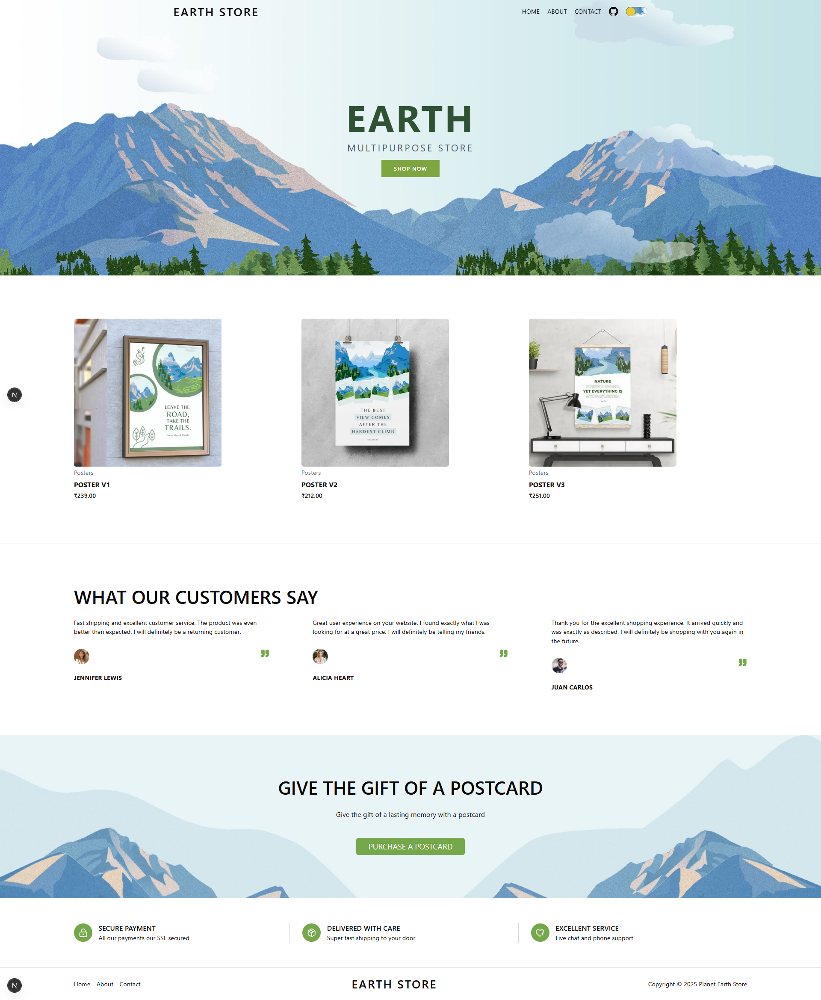
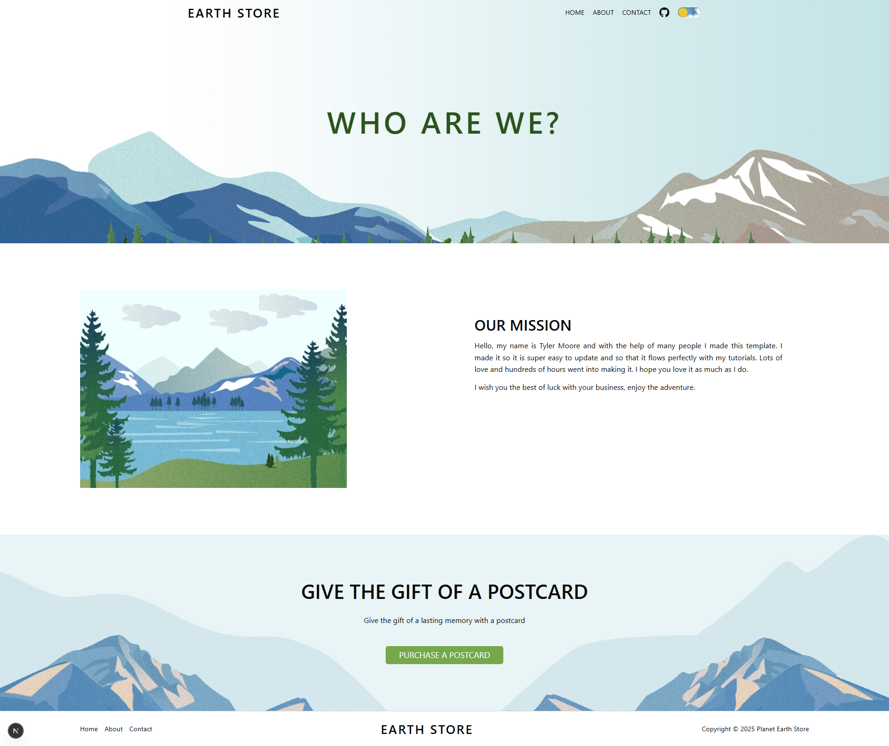
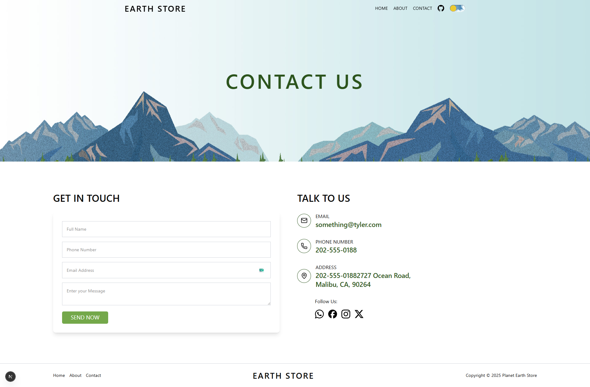

# 🌍 Earth Store - Frontend Landing Page

A modern, high-performance landing page built with **Next.js 16**, **TypeScript**, and **Tailwind CSS**. This project demonstrates a clean architecture, responsive design, and smooth animations.

## 📸 Project Previews

Here is a glimpse of the application's interface.

### 🏠 Home Page


### ℹ️ About Page


### 📞 Contact Page


---

## 🛠️ Tech Stack

This project is built using the latest modern web technologies:

| Category | Technology |
|----------|------------|
| **Framework** | [Next.js 16](https://nextjs.org/) (App Directory) |
| **Core** | [React 19](https://react.dev/) |
| **Language** | [TypeScript](https://www.typescriptlang.org/) |
| **Styling** | [Tailwind CSS v4](https://tailwindcss.com/) |
| **Icons** | [Lucide React](https://lucide.dev/) |
| **Theming** | [next-themes](https://github.com/pacocoursey/next-themes) |
| **Utils** | clsx, tailwind-merge, class-variance-authority |
| **Tooling** | Bun / npm, ESLint, Prettier |

## ✨ Features

- 🌓 **Dark/Light Mode Support**: Seamless theme switching with system detection preference.
- 📱 **Fully Responsive**: Optimized for all screen sizes (Mobile, Tablet, Desktop).
- ⚡ **High Performance**: Built with Next.js Server Components for optimal speed.
- 🎨 **Modern UI/UX**: Clean, minimalist design with smooth transitions.
- 🧩 **Modular Architecture**: Component-based structure for easy maintenance and scalability.

## 🚀 Getting Started

Follow these steps to set up the project locally on your machine.

### Prerequisites

Ensure you have **Node.js** (v18+) or **Bun** installed.

### Installation

1. **Clone the repository:**
   ```bash
   git clone https://github.com/piyushsarkar-dev/earth-landing-frontend-project.git
   cd earth-landing-frontend-project
   ```

2. **Install dependencies:**
   Using npm:
   ```bash
   npm install
   ```
   Or using Bun:
   ```bash
   bun install
   ```

3. **Run the development server:**
   ```bash
   npm run dev
   # or
   bun dev
   ```

4. **Open your browser:**
   Navigate to [http://localhost:3000](http://localhost:3000) to see the application running.

## 📂 Project Structure

A quick look at the top-level directory structure:

```bash
earth-landing-frontend-project/
├── public/                 # Static assets (images, icons)
├── src/
│   ├── app/                # Next.js App Router pages (Home, About, Contact)
│   ├── components/         # Reusable React components
│   │   ├── Header/         # Navbar and Menu components
│   │   ├── Providers/      # App providers (Theme, etc.)
│   ├── lib/                # Utility helpers (utils.ts)
│   └── hooks/              # Custom React hooks
├── next.config.ts          # Next.js configuration
├── tailwind.config.ts      # Tailwind CSS configuration
└── tsconfig.json           # TypeScript configuration
```

## 🤝 Contributing

Contributions, issues, and feature requests are welcome! Feel free to check the [issues page](https://github.com/piyushsarkar-dev/earth-landing-frontend-project/issues).

## 📄 License

This project is licensed under the **MIT License**.

---

<p align="center">
  Made with ❤️ by <a href="https://github.com/piyushsarkar-dev">Piyush Sarkar</a>
</p>
